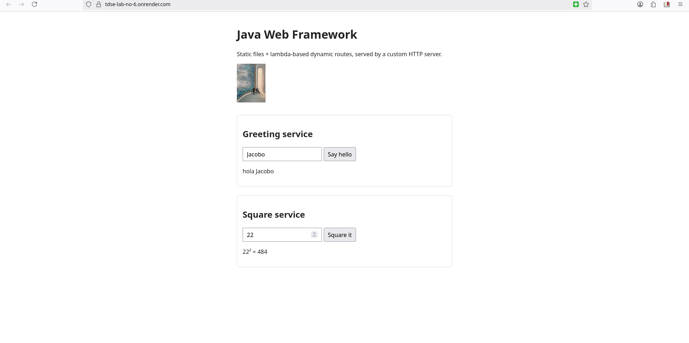
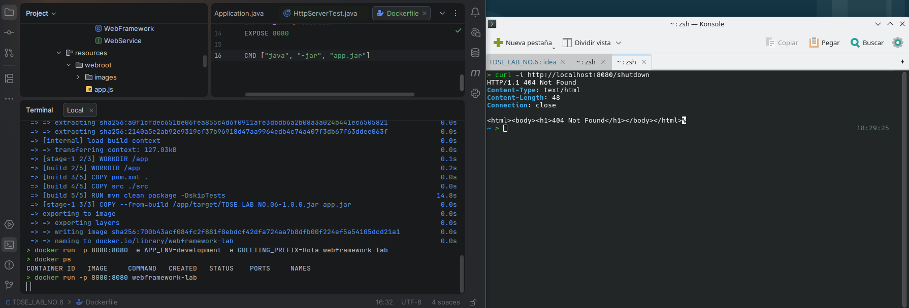
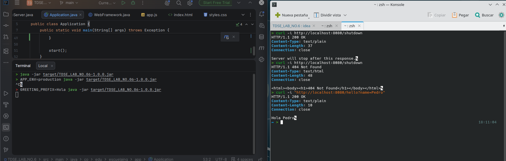
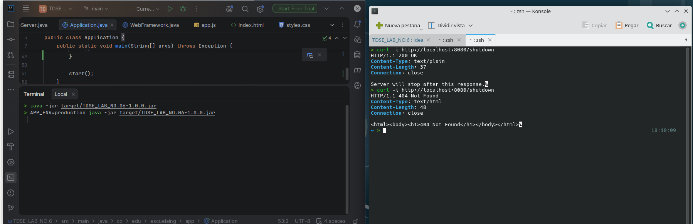
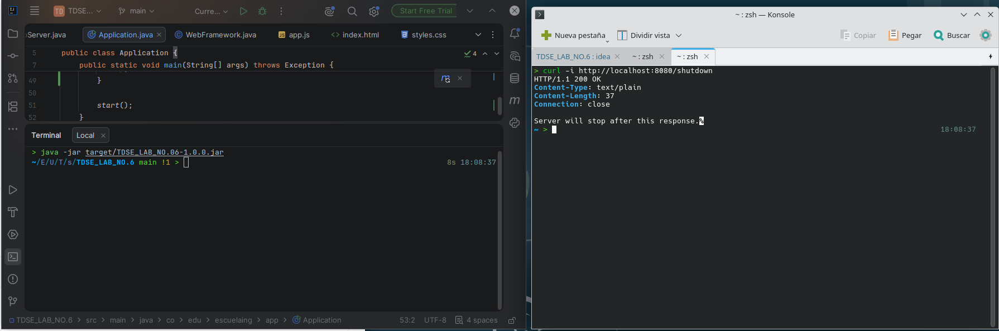

# Java Web Framework

Autor: *Jacobo Díaz Alvardo*


## Descripción del proyecto

Este proyecto evoluciona un servidor HTTP básico hacia un pequeño *application server* (framework web) en Java. Permite registrar rutas GET dinámicas mediante funciones lambda, servir archivos estáticos (HTML, CSS, JS, imágenes), leer parámetros de query string, y configurar el despliegue a través de variables de entorno. El servidor procesa las conexiones de forma **secuencial**, sin hilos ni concurrencia.

La aplicación se despliega como contenedor Docker en la nube (Render), y expone tanto recursos estáticos como servicios dinámicos a través de una URL pública.

## Arquitectura

```
Application
    Registra rutas y configuración (get, staticfiles)
        │
        ▼
WebFramework (fachada estática)
    Expone get(), staticfiles(), start(), stop()
        │
        ▼
Router
    Relaciona método + path → lambda handler
        │
        ▼
HttpServer
    Acepta conexiones, parsea peticiones, arma respuestas
        │
        ▼
Request / Response
    Representan los datos de la petición y la respuesta HTTP
        │
        ▼
StaticFileService
    Sirve archivos desde webroot/ cuando no hay ruta dinámica
```

### Responsabilidades de los componentes principales

| Componente | Responsabilidad |
|---|---|
| `WebFramework` | Fachada estática. Punto de entrada único para registrar rutas (`get`), configurar recursos estáticos (`staticfiles`) e iniciar/detener el servidor (`start`/`stop`). |
| `Router` | Guarda las rutas registradas y resuelve, dado un método y un path, cuál lambda debe ejecutarse. No conoce nada de sockets ni de HTTP crudo. |
| `Route` | Representa una única entrada del router: método, path y handler asociado. |
| `HttpServer` | Acepta conexiones TCP, parsea la petición, delega en `Router` y `StaticFileService`, y escribe la respuesta. Es el único componente que toca sockets. |
| `Request` | Encapsula método, path y parámetros de query string ya parseados. |
| `Response` | Encapsula el código de estado y el content type que una lambda puede modificar. |
| `StaticFileService` | Busca archivos dentro de `webroot/` en el classpath y determina su content type. Protege contra path traversal (`..`). |
| `WebService` | Interfaz funcional `(Request, Response) -> String` que representa un handler dinámico. |

## Metáfora: la pizzería

| Elemento de la pizzería | Componente del framework |
|---|---|
| El mesero que recibe cada pedido | `HttpServer`: recibe cada conexión y su solicitud, una a la vez, sin atender dos mesas al mismo tiempo (servidor secuencial) |
| El menú en la barra | `Router`: indica qué estación de la cocina debe preparar cada pedido, según lo que se pidió |
| Las estaciones de cocina (pizzero, ensaladas, postres) | Lambdas (`WebService`): cada una prepara un pedido específico (`/hello`, `/square`) |
| La vitrina con productos ya preparados | `StaticFileService`: entrega directamente lo que ya está listo (HTML, CSS, JS, imágenes) cuando el pedido no requiere cocinar nada nuevo |
| Las recetas y reglas del local | Variables de entorno: `PORT`, `APP_ENV`, `GREETING_PREFIX` — ajustan cómo opera la pizzería sin cambiar su funcionamiento interno |
| El cierre del local | Apagado gradual (`/shutdown`): la pizzería termina de entregar el pedido que tiene en curso antes de apagar el horno y cerrar la puerta |

Cada plato nuevo del menú (una nueva ruta) se agrega abriendo una estación de cocina adicional, nunca hay que reformar la barra de pedidos ni el salón para eso. Esa es la razón central por la que el diseño es mantenible.

## Por qué esta arquitectura es mantenible

| Principio | Aplicación en este proyecto |
|---|---|
| Separación de responsabilidades | La infraestructura HTTP (`HttpServer`) está separada del comportamiento de la aplicación (lambdas en `Application`). |
| Modularidad | Enrutamiento, parseo de peticiones, archivos estáticos y servicios están en clases distintas. |
| Bajo acoplamiento | Agregar una ruta nueva no requiere tocar `HttpServer`. |
| Alta cohesión | Cada clase tiene una única responsabilidad clara. |
| Abstracción | El desarrollador usa `get()` y `staticfiles()` sin manejar sockets directamente. |
| Configuración externalizada | `PORT`, `APP_ENV` y `GREETING_PREFIX` viven fuera del código fuente. |
| Extensibilidad | Nuevos servicios se agregan registrando funciones lambda. |
| Testabilidad | `Request`, `Router` y `StaticFileService` se prueban de forma aislada, sin abrir sockets. |
| Mantenibilidad operacional | El mismo artefacto (jar / imagen Docker) corre igual en local y en la nube. |

## Cómo compilar y ejecutar localmente

### Requisitos
- Java 21
- Maven

### Compilar

```bash
mvn clean package
```

### Ejecutar

```bash
java -jar target/TDSE_LAB_NO.06-1.0.0.jar
```

Por defecto arranca en el puerto `8080` con `APP_ENV=development` (por lo que `/shutdown` está disponible).

### Ejecutar con variables de entorno personalizadas

```bash
GREETING_PREFIX=Hola APP_ENV=development PORT=8080 java -jar target/TDSE_LAB_NO.06-1.0.0.jar
```

### Ejecutar pruebas

```bash
mvn test
```

## Variables de entorno

| Variable | Propósito | Valor por defecto |
|---|---|---|
| `PORT` | Puerto en el que escucha el servidor HTTP | `8080` |
| `GREETING_PREFIX` | Prefijo usado por la ruta `/hello` | `Hello` |
| `APP_ENV` | Entorno de ejecución. Si es `production`, la ruta `/shutdown` no se registra | `development` |

## Despliegue en la nube

**Plataforma usada:** Render (Web Service, despliegue a partir de `Dockerfile`).

**URL pública:** https://tdse-lab-no-6.onrender.com


## Ejemplos de URLs

| Recurso | URL |
|---|---|
| Página principal | `https://tdse-lab-no-6.onrender.com/index.html` |
| Estilos | `https://tdse-lab-no-6.onrender.com/styles.css` |
| Script | `https://tdse-lab-no-6.onrender.com/app.js` |
| Imagen | `https://tdse-lab-no-6.onrender.com/images/logo.png` |
| Servicio de saludo | `https://tdse-lab-no-6.onrender.com/hello?name=Pedro` |
| Servicio de cuadrado | `https://tdse-lab-no-6.onrender.com/square?value=7` |
| Recurso inexistente (404) | `https://tdse-lab-no-6.onrender.com/no-existe` |
| Apagado (solo en desarrollo) | `https://tdse-lab-no-6.onrender.com/shutdown` |

## Evidencia del funcionamiento en la nube

### Página desplegada



### Prueba crítica: contenedor Docker respondiendo correctamente



### Endpoint dinámico: `/hello` con `GREETING_PREFIX` configurado



### `/shutdown` en producción (`APP_ENV=production`)

Con `APP_ENV=production`, la ruta `/shutdown` **no** se registra. La petición contra la URL pública devuelve `404 Not Found`, confirmando que el apagado remoto está deshabilitado:



## Evidencia de `/shutdown` en desarrollo (local)

Con `APP_ENV=development` (valor por defecto), `/shutdown` sí está disponible. Al invocarlo:

1. El servidor responde `200 OK` con el mensaje `Server will stop after this response.`
2. La terminal donde corría el servidor vuelve al prompt por sí sola, confirmando que el proceso terminó de forma controlada tras responder.



## Pruebas realizadas

### Pruebas unitarias (JUnit)

- `RequestTest`: parseo de método, path y parámetros de query string; manejo de parámetros ausentes; decodificación de valores con caracteres especiales; comportamiento ante query strings malformadas.
- `RouterTest`: registro y resolución de rutas; rutas no encontradas devuelven `Optional.empty()`; mismo path con distinto método no coincide; rechazo de rutas duplicadas con `IllegalStateException`.
- `StaticFileServiceTest`: servir `index.html`, servir la imagen binaria (`logo.png`), archivo inexistente, protección contra path traversal (`/../pom.xml`), mapeo de `/` a `index.html`, rechazo de directorios sin extensión.

Ejecutar con:
```bash
mvn test
```

### Pruebas de integración (`HttpServerTest`)

Levantan el servidor real en un puerto de prueba y verifican, contra HTTP real:
- Ruta dinámica con parámetro (`/hello?name=Pedro` → `200`, `Hello Pedro`).
- Ruta dinámica sin parámetro (`/hello` → `200`, `Hello world`).
- Archivo estático servido correctamente (`/index.html` → `200`, `text/html`).
- Recurso inexistente (`/no-existe` → `404`).
- Método no permitido (`POST /hello` → `405`).
- Excepción en una lambda (`/boom` → `500`), confirmando que un error de la aplicación no tumba la conexión.

### Pruebas manuales (local, con `curl`)

```bash
curl -i "http://localhost:8080/hello?name=Pedro"     # 200 - Hello Pedro
curl -i http://localhost:8080/hello                  # 200 - Hello world
curl -i http://localhost:8080/index.html              # 200 - text/html
curl -i http://localhost:8080/images/logo.png          # 200 - image/png
curl -i http://localhost:8080/no-existe                 # 404
curl -i -X POST http://localhost:8080/hello             # 405
curl -i http://localhost:8080/shutdown                  # 200 (solo en development)
```

### Pruebas manuales (producción, con `curl`)

```bash
curl -i "https://tdse-lab-no-6.onrender.com/hello?name=Pedro"   # 200
curl -i https://tdse-lab-no-6.onrender.com/index.html             # 200
curl -i https://tdse-lab-no-6.onrender.com/images/logo.png         # 200
curl -i https://tdse-lab-no-6.onrender.com/no-existe                # 404
curl -i https://tdse-lab-no-6.onrender.com/shutdown                  # 404 (APP_ENV=production)
```

## Estructura del proyecto

```
src/main/java/
└── co/edu/escuelaing/
    ├── webframework/
    │   ├── HttpServer.java
    │   ├── WebFramework.java
    │   ├── Router.java
    │   ├── Route.java
    │   ├── Request.java
    │   ├── Response.java
    │   ├── StaticFile.java
    │   ├── StaticFileService.java
    │   └── WebService.java
    └── app/
        └── Application.java

src/main/resources/webroot/
├── index.html
├── app.js
├── styles.css
└── images/
    └── logo.png

src/test/java/co/edu/escuelaing/webframework/
├── RequestTest.java
├── RouterTest.java
├── StaticFileServiceTest.java
└── HttpServerTest.java

Dockerfile
pom.xml
```